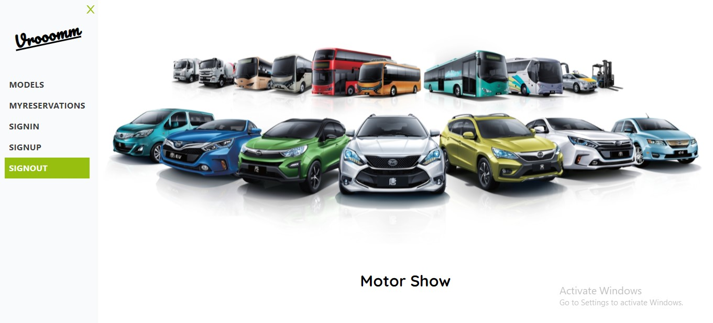

#  MotorShow
- It is an online show-room of the latest high-end vehicles in the market. The cars are on display and available to be reserved for purchase.
- User should sign up and sign in to view the whole selection on display, view each car individual and make a reservation for that car if they do wish to purchase it later on.

## BUILT WITH
- JavaScript
- Node.js
- React
- React-Create-App
- Redux
- ES6
- CSS

## Getting Started

To run this project locally, you must have node and npm installed on your machine.

# Setup
To set up this project on your local machine:

Navigate to the folder where you want the repository to be copied and run 

`git clone https://github.com/Leon-Mbegera/ReserveIt-frontend.git`

Navigate to the directory :

`cd reservit-frontend`

Install the npm dependencies: 

`npm install`

To start the server: 

`npm start`

Go to http://localhost:3001/ in your browser to see the application running

## Author

👤 **Leon**

- GitHub: [github](https://github.com/Leon-Mbegera)
- LinkedIn: [LinkedIn](https://www.linkedin.com/in/leon-mbegera)

## 🤝 Contributing

Contributions, issues and feature requests are welcome!

Feel free to check the [issues page](https://github.com/Leon-Mbegera/ReserveIt-frontend/issues/).

## Show your support

Give a ⭐️ if you like this project!
